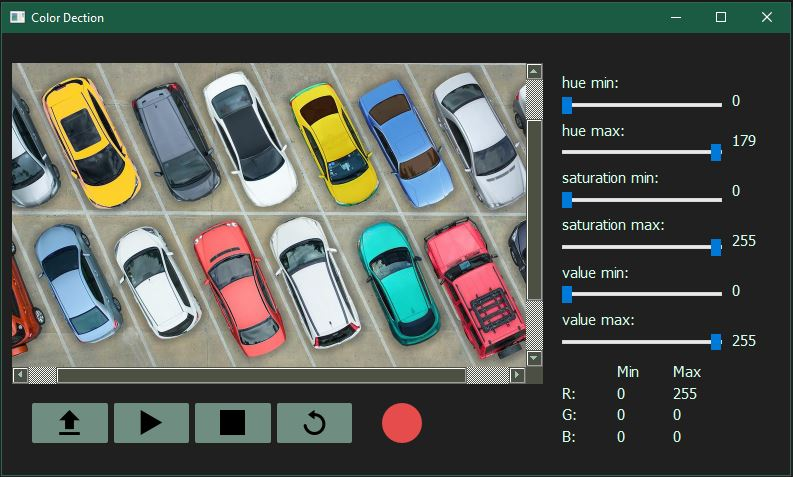
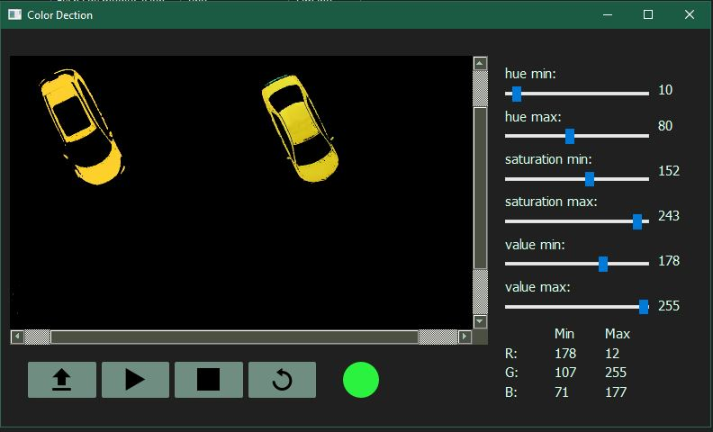

# App Color Dection

<div>
    
    
</div>

## Description

Aplicación de escritorio para segmentar colores

## Dependecias 
```
numpy==1.20.3
opencv-python==4.5.2.52
PySide2==5.15.2
shiboken2==5.15.2
```

## .ui to .py
```
pyside2-uic form.ui -o form.py
```

## create .exe
```
pyinstaller --hidden-import PySide2.QtXml app.py
```
 
## RUN app
```
py app.py
```